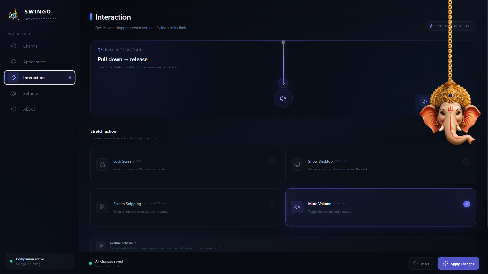
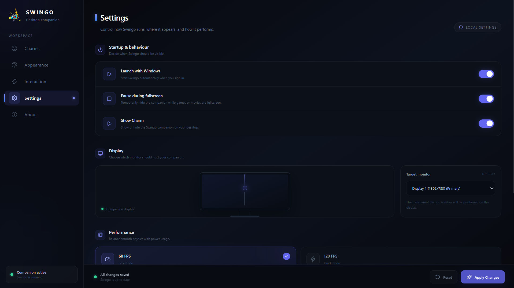

# Swingo 🎯

An interactive, physics-based desktop companion with customizable charms that react to window movements, cursor interactions, and gravity.

---

## 🌐 Download

Download the latest version directly from our official website:

👉 **[Download Swingo]([https://swingo-eta.vercel.app/](https://apps.microsoft.com/detail/9NRCMH42WMVR?hl=en-us&gl=US&ocid=pdpshare))**

---

## 📸 App UI

### Desktop Companion

### Interaction Mode

### Settings Panel

---

## 👤 Author

- **Surya Perumal Jeyapandi**
- GitHub: [@Surya-7666](https://github.com/Surya-7666)
